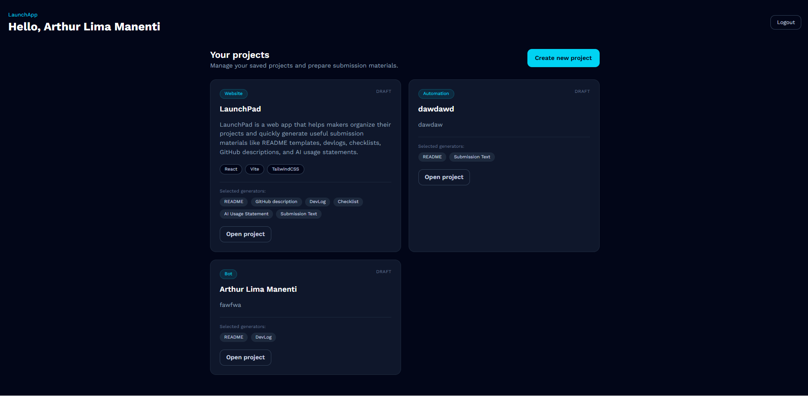

# Project Submission Helper

A quality-of-life web app that helps makers organize projects and quickly generate submission materials like README templates, devlogs, checklists, GitHub descriptions, and AI usage statements.

## Live Demo

[Open the live demo here](https://launch-pad-swart.vercel.app/auth/login)

## Screenshot



## About

Project Submission Helper is a small quality-of-life tool created to make the project submission process smoother.

When building and submitting projects, makers often need to rewrite the same information several times: project description, README, demo links, devlogs, checklists, GitHub descriptions, and AI usage statements.

This app solves that problem by letting users save project information once and generate useful submission materials from it.

## Quality-of-Life Improvement

The main QoL improvement is reducing repetitive writing and organization work when preparing a project for submission.

Instead of manually creating every submission resource from scratch, the user can:

- create a project once;
- save all important links and details;
- choose what resources they want to generate;
- copy or download the generated materials;
- reuse the saved project information later.

This saves time and keeps the submission workflow more organized.

## Major QoL Improvements

This project includes 3 major quality-of-life improvements:

1. **Centralized project organization**
   Users can store project name, type, technologies, GitHub link, demo link, goals, challenges, and learning notes in one place.

2. **Automatic resource generation**
   The app can generate README templates, devlogs, checklists, GitHub descriptions, AI usage statements, and submission text from the saved project data.

3. **Copy and download workflow**
   Generated resources can be copied or downloaded directly, making it faster to use them in GitHub, Hack Club submissions, or other platforms.

## Features

- Simple local login using `localStorage`
- Protected routes with React Router
- Dashboard with saved projects
- Create new projects with detailed information
- Select which resources should be generated
- Dynamic project details page using `/projects/:id`
- Generate README, DevLog, Checklist, GitHub Description, AI Usage Statement, and Submission Text
- Copy generated text
- Download generated resources as files
- Delete saved projects
- Data persistence using browser `localStorage`

## Built With

- React
- Vite
- TailwindCSS
- React Router
- localStorage

## How It Works

1. The user logs in locally.
2. The user creates a new project.
3. The user fills in project information such as description, links, technologies, goals, challenges, and what they learned.
4. The user selects the resources they want to generate.
5. The project is saved in `localStorage`.
6. The user opens the project details page.
7. The app generates the selected resources.
8. The user can copy or download the generated content.

## How to Run Locally

Clone the repository:

```bash
git clone PASTE_YOUR_REPOSITORY_LINK_HERE
```

Enter the project folder:

```bash
cd project-submission-helper
```

Install dependencies:

```bash
npm install
```

Run the development server:

```bash
npm run dev
```

Open the local URL shown in your terminal, usually:

```bash
http://localhost:5173
```

## Submission Requirements

This project was built to match the Hack Club submission requirements:

### 1. A clear quality-of-life improvement

Project Submission Helper improves quality of life by reducing the repetitive work involved in preparing project submissions.

It helps users avoid rewriting the same project information multiple times across README files, devlogs, descriptions, checklists, and submission forms.

### 2. A working and usable project

The app is functional and usable. Users can log in, create projects, save data locally, view previous projects, open project details, generate resources, copy text, download files, and delete projects.

### 3. Effort and thoughtful execution

The project includes multiple pages, protected routes, local data persistence, dynamic project pages, reusable generator functions, and a polished interface built with TailwindCSS.

### 4. Clear explanation of the problem being solved

The problem is that project submission workflows are repetitive and scattered. Makers often need to prepare the same information in different formats.

This app centralizes that workflow and turns saved project information into ready-to-use resources.

### 5. Minimum 3 hours spent

This project involved planning the idea, designing the interface, building the login flow, setting up protected routes, creating the project form, saving data to localStorage, building the dynamic project page, implementing generators, and polishing the final project.

### 6. 3 major QoL improvements

The project includes:

- centralized project information;
- automatic generation of submission resources;
- copy and download actions for generated content.

## What I Learned

While building this project, I practiced creating a complete React app flow with protected routes, form actions, localStorage data persistence, dynamic project pages, and reusable generator functions.

I also learned how small workflow tools can save time by removing repetitive tasks.

## AI Usage

AI tools were used to help with planning, documentation, UI ideas, and debugging support. The implementation, testing, project decisions, and final structure were reviewed and adapted by me.
